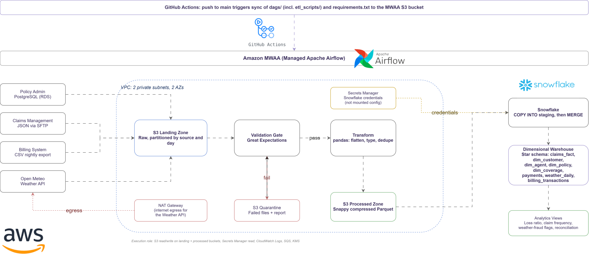

# Sentinel Auto Insurance - Data Platform Pipeline

A daily batch data pipeline that unifies Sentinel Auto Insurance's three siloed operational systems (policy admin, claims, billing) plus an external weather API into a single Snowflake dimensional warehouse, enabling cross-system analytics for underwriting, claims, and fraud review.

## Problem Statement

Sentinel's three core systems, a PostgreSQL-backed policy admin platform, a vendor-managed claims system exporting nested JSON, and a billing platform exporting nightly CSVs, were procured independently and were never built to share data. There is no unified customer view, no automated reconciliation between systems, and no integration with external risk data such as weather. Cross-system reporting currently requires manual, error-prone stitching in Excel, taking days to assemble and weeks to reconcile, which delays underwriting, reserving, and fraud-detection decisions.

This project builds an internal data platform that extracts from all four sources daily, lands and validates the data in a multi-zone S3 lake, transforms it with pandas, and loads it into a Snowflake star schema, replacing manual report assembly with same-day, query-ready analytics.

## Architecture


*Placeholder. Shows the pipeline architecture diagram (extraction, S3 landing, validation, pandas transform, S3 processed, Snowflake COPY INTO, dimensional warehouse).*

**Flow:** `PostgreSQL / SFTP JSON / CSV / Weather API` feeds the **S3 Landing Zone** (raw, partitioned by source and day), which passes through **Great Expectations validation** (pass goes to processed, fail goes to quarantine), then **pandas transformation** (flatten, type, dedupe), landing in the **S3 Processed Zone** (Parquet), which loads via **Snowflake COPY INTO + MERGE** into the **Star Schema Warehouse**. All stages are orchestrated by **Apache Airflow**.

## Data Model

Star schema centered on `claims_fact`, joined to four conformed dimensions (`dim_customer`, `dim_agent`, `dim_policy`, `dim_coverage`) and a `payments` table. `weather_daily` is a separate enrichment table joined to `claims_fact` on `(incident_zip, incident_date)`. Dimensions hold current state only in v1 (SCD Type 2 is a scoped-out future enhancement). See [`docs/data_dictionary.md`](docs/data_dictionary.md) for full column-level definitions.

## Tech Stack

| Layer | Tools |
|---|---|
| Extraction | `psycopg2`, `pandas`, `boto3`, `requests` |
| Storage | Amazon S3 (multi-zone: landing / processed / quarantine) |
| Processing | pandas, PyArrow (Parquet, Snappy) |
| Validation | Great Expectations |
| Warehouse | Snowflake (COPY INTO + MERGE via external stage) |
| Orchestration | Apache Airflow |
| Source DB | Amazon RDS (PostgreSQL) |


## Project Structure
 
```
sentinel-pipeline/
├── dags/                   # Airflow DAG + etl_scripts package (extractors, validators, transformers)
├── scripts/                # Setup, teardown, MWAA provisioning, and deployment scripts
├── sql/                    # Snowflake DDL, staging/merge loaders, analytics views, idempotency checks
├── docker/                 # Local Airflow image (Airflow doesn't run natively on Windows)
├── docker-compose.airflow.yml
├── .github/workflows/      # CI: auto-deploys to MWAA on push to main
├── docs/                   # Setup guides, data dictionary, MWAA provisioning/deployment docs
├── tests/                  # pytest suite
├── source_systems/         # Local raw source data (gitignored)
├── .env.example
└── README.md
```
 
See [`docs/project_structure.md`](docs/project_structure.md) for the full file-by-file layout.


## Prerequisites

- Python 3.10+
- AWS account with permissions to create S3 buckets and an RDS instance
- Snowflake account (trial or paid)
- Access to Sentinel source data drops (policy admin CSVs, claims JSON, billing CSV)

## Setup

**Fast path**: after cloning, see [`docs/SETUP_CHECKLIST.md`](docs/SETUP_CHECKLIST.md) for the single-page version of everything below, what to fill in, and `./scripts/preflight_check.sh` to verify it's all actually working before running the pipeline. The numbered steps below are the same information in full detail, useful the first time through or when troubleshooting a specific failure.

1. **Clone and create a virtual environment**
   ```bash
   git clone https://github.com/<your-org>/sentinel-pipeline.git
   cd sentinel-pipeline
   python -m venv venv
   source venv/bin/activate   # Windows: venv\Scripts\activate
   pip install -r requirements.txt
   ```

2. **Install and configure the AWS CLI**

   See [`docs/aws_cli_setup.md`](docs/aws_cli_setup.md) for install steps and `aws configure` walkthrough. Do this before provisioning any AWS resources, both the S3 and RDS setup docs below use it, and the extractors authenticate through the same credentials via `boto3`.

3. **Configure environment variables**
   ```bash
   cp .env.example .env
   ```
   Populate `.env` with RDS master/app credentials (you invent these yourself, they don't exist yet), S3 bucket names, and Snowflake account/user/password/warehouse/database/schema. AWS credentials are picked up from `~/.aws/credentials` (set in step 2) and do not need to be duplicated in `.env`. `.env` is gitignored. Never commit credentials. `PG_HOST` doesn't need filling in, it's written automatically by the next step.

4. **Provision AWS resources**
   ```bash
   ./scripts/setup_aws.sh
   ```
   Creates both S3 buckets, the RDS instance with a security group locked to your current IP, waits for it to become available, writes the real endpoint into `.env` automatically, and bootstraps the `sentinel` role and database. Safe to re-run, existing resources are detected and skipped. See [`docs/aws_setup.md`](docs/aws_setup.md) and [`docs/policy_admin_db_setup.md`](docs/policy_admin_db_setup.md) if you'd rather do each piece manually, or need to troubleshoot a specific step.

   Once this finishes, run `./scripts/preflight_check.sh` to confirm AWS, S3, and RDS are all actually reachable before continuing.

5. **Pull source data from Google Drive (manual download, recommended)**

   Download the shared Drive folder through your browser (logged in, so it uses your account's quota rather than an anonymous one) and place the contents in `source_systems/`, preserving the `billing_exports/` and `sftp_claim_source/` folder structure, and flattening the four policy admin CSVs to the top level:
   ```bash
   mv source_systems/policy_admin/*.csv source_systems/
   rmdir source_systems/policy_admin
   ```
   The automatic option (`python scripts/pull_source_data.py`) exists but repeatedly fails partway through with `FileURLRetrievalError`, Google Drive rate-limits anonymous downloads on large folders (the claims folder alone is 300+ files), and this has broken in practice more often than it's worked. Manual download avoids that entirely. See [`docs/source_data_pull.md`](docs/source_data_pull.md) for the full flow either way.

6. **Seed the policy admin database**
   ```bash
   python scripts/seed_policy_admin_db.py
   ```
   `--bootstrap` already ran as part of `setup_aws.sh` in step 4, no need to repeat it here unless you edited `PG_APP_PASSWORD` in `.env` afterward, in which case re-running `python scripts/seed_policy_admin_db.py --bootstrap` syncs the database to match. See [`docs/policy_admin_db_setup.md`](docs/policy_admin_db_setup.md) for the full RDS setup and role-bootstrapping walkthrough.

7. **Run extractors locally (ad hoc / testing)**
   ```bash
   python extractors/extract_policy_admin.py --day 2026-01-15
   python extractors/extract_claims.py
   python extractors/extract_billing.py
   python extractors/extract_weather.py --day 2026-01-15
   ```
   Steps 5 through 7 can be run together with `./scripts/sync_source_to_s3.sh 2026-01-15`.

8. **Run validation**
   ```bash
   python -m validators.validate --all --day 2026-01-15      # lightweight pandas version
   python -m validators.validate_ge --all --day 2026-01-15   # real Great Expectations version
   ```
   Both check the same contracts and quarantine the same way. `validate_ge.py` builds a real Great Expectations ephemeral Data Context with a pandas Datasource, one whole-dataframe Batch Definition per dataset, and a genuine `ExpectationSuite` (`ExpectColumnToExist`, `ExpectColumnValuesToNotBeNull`, `ExpectColumnValuesToBeInTypeList`), saved as JSON under `validators/expectation_suites/` on first run. This requires `great_expectations>=1.5` (not the older `0.18.x` API, which lacks the batch definition workflow). `validate.py` is a lighter pandas-only equivalent kept for comparison, it has no Great Expectations dependency at all.

   becomes, after the `etl_scripts` migration:
   ````bash
   PYTHONPATH=dags python -m etl_scripts.validators.validate_ge --dataset claims --day 2026-01-15
   ````
   (or `cd dags` first, then drop the `PYTHONPATH=dags` prefix)

9. **Run transformation**
   ```bash
   python transformers/transform_policy_admin.py --day 2026-01-15
   python transformers/transform_claims.py --day 2026-01-15
   python transformers/transform_billing.py --day 2026-01-15
   python transformers/transform_weather.py --day 2026-01-15
   ```

10. **Create Snowflake objects**

   First, confirm the connection actually works before running anything that creates objects:
   ```bash
   snowsql -c sentinel -q "SELECT CURRENT_VERSION();"
   ```
   This should print a version string and exit cleanly. If it fails (MFA error, 404, "could not connect," etc.), fix that first, see [`docs/snowflake_setup.md`](docs/snowflake_setup.md), rather than debugging it in the middle of a DDL run. `./scripts/preflight_check.sh` also covers this same check alongside AWS/S3/RDS.

   Once that passes:
   ```bash
   snowsql -c sentinel -f sql/ddl/create_warehouse_and_database.sql
   snowsql -c sentinel -f sql/ddl/create_tables.sql
   snowsql -c sentinel -f sql/ddl/create_stage.sql
   ```
   These commands assume `snowsql` is installed and `~/.snowsql/config` has a connection named `sentinel` (see setup below). If you set `default = sentinel` in the config's `[connections]` section, you can drop `-c sentinel` from these commands, but leaving it explicit avoids a confusing fallback to interactive password prompts if no default is set. The warehouse/database script must run first, the other two assume `SENTINEL_WH` and `SENTINEL_DB` already exist. See [`docs/snowflake_setup.md`](docs/snowflake_setup.md) for installing `snowsql`, setting up `~/.snowsql/config`, and MFA/key-pair authentication.

11. **Set up Airflow**

   Apache Airflow does not support native Windows (confirmed directly by Airflow's own startup warning: "you can run it via WSL2... or via Linux Containers"). Running it natively in Git Bash fails with a `Cannot use relative path: sqlite:///C:/...` error, that's not fixable with environment variables, it's a fundamental platform limitation.

   ```bash
   ./scripts/run_airflow.sh
   ```

   This runs Airflow inside a Docker container (via `docker-compose.airflow.yml`), sidestepping the Windows limitation entirely, and is also the officially recommended way to run Airflow locally regardless of OS. Login uses `AIRFLOW_ADMIN_USERNAME`/`AIRFLOW_ADMIN_PASSWORD` from `.env`, see [`docs/airflow_setup.md`](docs/airflow_setup.md) for the full walkthrough and how to trigger a DAG run.

   The DAG itself is parameterized on Airflow's `execution_date` macro, so backfills can be run for any historical day.

## Running the Full Pipeline

With `./scripts/run_airflow.sh` running, trigger a manual run for a given day through the Web UI (`http://localhost:8080`) or the CLI:
```bash
docker compose -f docker-compose.airflow.yml exec airflow airflow dags trigger sentinel_daily_pipeline -e 2026-01-15
```

## Teardown

AWS resources (RDS, S3) bill by the hour/GB whether or not they're in use. When stepping away from active development, tear them down:

```bash
./scripts/teardown_aws.sh
```

See [`docs/aws_teardown.md`](docs/aws_teardown.md) for the manual step-by-step breakdown and how to bring everything back up again later. Snowflake doesn't need equivalent teardown, trial accounts run on credits rather than a running meter, and warehouses auto-suspend on inactivity.

## Data Quality

Landing files are validated against schema contracts defined in `validators/contracts.py` (column existence, type/parseability, required non-null fields) before promotion to the processed zone. Files that fail validation are routed to `s3://sentinel-landing/quarantine/` along with a `validation_report.json` detailing every failed expectation, and an alert is raised.

## Analytics Views

```bash
snowsql -c sentinel -f sql/views/create_analytics_views.sql
```

Creates four views in `ANALYTICS` answering the case study's headline questions (loss ratio by agent/territory, claim frequency by zip, weather-context fraud review flags, billed-vs-collected reconciliation), see [`docs/data_dictionary.md`](docs/data_dictionary.md) for what each one covers.

To verify idempotency directly (no duplicate rows regardless of how many times a day has been re-run):

```bash
snowsql -c sentinel -f sql/checks/idempotency_check.sql
```


## Deploying to MWAA
 
Local Docker Airflow (above) proves the pipeline logic. For real managed cloud orchestration:
 
1. **Provision the environment**: [`docs/mwaa_setup.md`](docs/mwaa_setup.md), covers cost (this is the one genuinely expensive piece of this project, read that section first), the VPC/NAT/execution role setup, and `scripts/setup_mwaa.sh`.
2. **Deploy the DAG and code**: [`docs/mwaa_deploy.md`](docs/mwaa_deploy.md), covers the one-time `etl_scripts` restructuring (MWAA only puts `dags/` on `sys.path`, not the repo root), manual deployment via `scripts/deploy_to_mwaa.sh`, and automated deployment via `.github/workflows/deploy-mwaa.yml` on every push to `main`.
 
```bash
python scripts/migrate_to_etl_scripts.py   # one-time
./scripts/setup_mwaa.sh                     # provisions AWS infrastructure
./scripts/deploy_to_mwaa.sh                 # syncs the DAG and dependencies
```
 
Always pair a session with `./scripts/teardown_mwaa.sh` when done testing, see the cost breakdown in `docs/mwaa_setup.md`.


## Testing

```bash
pytest tests/
```

## Roadmap / Future Enhancements

- Slowly Changing Dimensions (SCD Type 2) for historical state tracking
- Automated reconciliation between billed and earned premium
- Fraud-detection and catastrophe-exposure models built on the weather/claims join
- Real-time or micro-batch ingestion for high-priority sources

## Contributing

1. Create a feature branch off `main`: `git checkout -b feature/<short-description>`
2. Make your changes, following the existing code structure and naming conventions
3. Add or update tests under `tests/` where applicable
4. Open a Pull Request with a clear description of the change and any schema impacts
5. At least one review approval is required before merging

## License

Licensed under the [MIT License](LICENSE).
